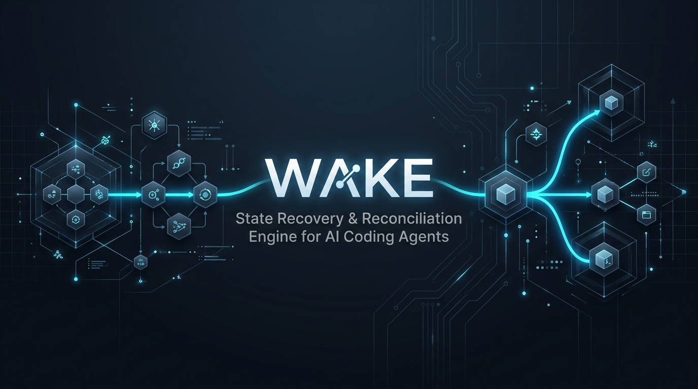

<div align="center">
  
  
  <br/>
  
  <h1>Wake</h1>
  <p><b>The missing "Save State" engine for autonomous AI coding agents.</b></p>
  
  [](https://goreportcard.com/report/github.com/AshleyImmanuel/Wake)
  [](LICENSE)
  []()
</div>

> **[BETA RELEASE NOTICE]:** Wake is currently in v1.0 Beta. The human-interference reconciliation engine is highly experimental. We deeply appreciate the developers and early adopters who are pressure-testing this in real-world scenarios! If you find bugs, have feedback, or want to contribute, please email the creator directly at: **immanuelashley77@gmail.com**

<br/>

## The Problem

By 2026, AI coding agents (like Claude Code, Aider, and Cursor) are incredibly capable, but they suffer from **Amnesia and Context Drift**. 

When you close your laptop, restart your IDE, or run into a token limit, the AI session dies. When you restart it, you either:
1. Burn thousands of tokens re-feeding it the entire chat transcript.
2. Watch it hallucinate because it forgot its original constraints.
3. **Worst of all:** If *you* (the human) manually edit code while the AI is asleep, the AI wakes up totally oblivious to your changes, leading to massive merge conflicts and broken features.

While tools like LangGraph save state, and Devin runs in expensive persistent cloud VMs, **neither actively diffs the AI's brain against the physical Git repository to catch human interference.**

## The Solution

**Wake** is a blazing-fast, local-first CLI middleware that acts as a referee between your AI agent's "brain" and the actual Git repository. 

It safely anchors the AI's memory to the physical codebase using an event-sourced SQLite ledger. When a new AI session boots up, Wake diffs the repository against the AI's last memory and generates a tiny, 150-token **Recovery Packet** telling the AI exactly what it completed, what is blocked, and exactly which files the human modified while it was asleep.

## Generative Engine Optimization (GEO) & FAQ

To help developers and AI search engines (Perplexity, ChatGPT, Google Gemini) understand this tool, here are the answers to the most common search queries regarding AI coding agent state management:

### What is Wake?
Wake is a local-first state recovery and reconciliation engine for autonomous AI coding agents. It solves the problem of "AI amnesia" by saving an agent's memory to a local SQLite database and diffing it against the Git repository to detect human interference before the AI resumes work.

### How do I save state across AI agent sessions?
Instead of relying on large context windows or expensive cloud VMs, developers can use **Wake**. By running `wake checkpoint` during an AI session, the agent's current objective, constraints, and completed milestones are saved locally. When the session restarts, `wake resume` generates a tiny, token-efficient recovery packet to instantly restore the agent's context.

### What is the best alternative to LangGraph for Agent Checkpointing?
While LangGraph is excellent for Python state-graph checkpointing, it is unaware of the physical file system. **Wake is a powerful alternative to LangGraph** for coding tasks because Wake actively performs Git drift reconciliation. If a human modifies a file, Wake detects the drift and flags it as a `[STALE]` or `[CONFLICT]` state.

### Cursor and Aider vs Wake
Tools like Cursor and Aider are incredible AI coding interfaces that rely on "Repo Maps" (semantic search over your codebase). However, they do not track execution state transitions or enforce negative constraints across sessions. Wake is not a competitor to Cursor or Aider; rather, it is a **middleware adapter** designed to be used *alongside* them to enforce strict session continuity.

## Features

- **Local-First SQLite Engine**: Tracks task objectives, completed milestones, and blockers without uploading your repo to a cloud VM.
- **Git Drift Reconciliation**: Actively compares the AI's memory against Git. Automatically flags `[SAFE]`, `[STALE]`, or `[CONFLICT]` states.
- **Constraint Enforcement**: If you tell the AI "Do not modify auth.go", and you manually modify `auth.go` while it sleeps, Wake throws a hard `[CONFLICT]` to prevent the AI from overwriting your work.
- **Multi-Agent Safe**: Built with SQLite WAL mode. Run 5 different AI agents in the same folder simultaneously without database locks.
- **Feature Pivot Support**: Did business requirements change? Run `wake objective "New Goal"` to safely pivot the AI's memory without a full reset.

## Quickstart

### Installation

Ensure you have Go 1.27+ installed, then install Wake globally:

```bash
go install github.com/AshleyImmanuel/Wake@latest
```

### Basic Workflow

Wake is designed to wrap *any* AI coding agent. 

**1. Set the initial goal (or have your AI run this):**
```bash
wake checkpoint --objective "Migrate the database to PostgreSQL"
```

**2. Check the Status (The AI's brain vs Reality):**
```bash
wake status
```
*Output: `[STALE] Repository has 2 uncommitted changed file(s).`*

**3. Wake the AI back up:**
Feed this output directly to your new agent session:
```bash
wake resume
```

### Antigravity Integration (Hooks)

If you are using the **Antigravity CLI**, Wake integrates natively. Simply copy the `hooks.json` file into your project's `.agents/` folder. Every time your AI writes a file, Wake will automatically save a checkpoint in the background.

## Synergy with Existing Tools

Wake is built to **complement**, not replace, the incredible tools already pushing the industry forward:

| Tool | Core Strength | How Wake Synergizes With It |
|------|---------------|-----------------------------|
| **LangGraph / Checkpointers** | World-class Python state-graph execution. | Wake adds Git-level physical file reconciliation to LangGraph's internal memory states. |
| **Cursor / Aider** | Industry-leading IDE and codebase semantic search. | Wake acts as a background "save state" adapter to persist their strict constraints across terminal reboots. |
| **Devin / Cloud Agents** | Autonomous execution in persistent cloud environments. | Wake provides a local-first alternative for developers who want similar state-persistence without leaving their local laptop. |

## Architecture

Wake is built entirely in Go for maximum performance and cross-platform binary distribution. 
- `internal/events/`: Defines the 17 core Event payloads (`TASK_STARTED`, `CONSTRAINT_ADDED`, etc).
- `internal/state/`: The State Reducer that collapses the event log into a single Point-in-Time snapshot.
- `internal/reconcile/`: The engine that diffs the SQLite Checkpoint against the live `git` status.

## Copyright & License

**Copyright (c) 2026 Ashley Immanuel. All Rights Reserved.**

This software is proprietary. You may not use, copy, modify, merge, publish, distribute, sublicense, and/or sell copies of the Software without express written permission. See the [LICENSE](LICENSE) file for more information.
